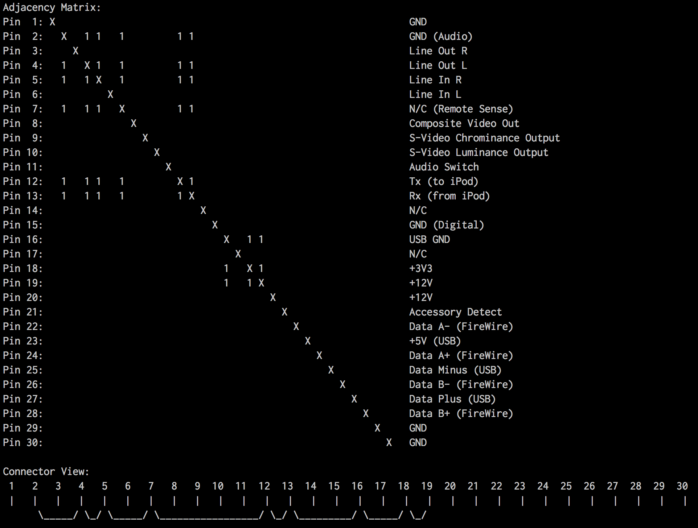

# Checkirona: iPhone Connector Short-Circuit Tester

[Corona][corona] uses the 30pin iPhone connector to communicate with everything.

This simple project uses an STM32F4 Discovery with a custom connector PCB board to test all 30 connections for a short circuit and displays it as an adjacency matrix and as a flattened connector view.

You must connect a USB-to-Serial connector and open a terminal using picocom:

	$ picocom --imap lfcrlf -b 115200 /dev/tty.usbserial-*

The output looks something like this:

This project was designed and manufactured at [The Media Computing Group][i10].

## Organization

This repository is organized as follows:

-	*pcb* contains the PCB schematics and layouts,
- 	*src* contains the application code for the tester, and
-	*xpcc* contains the git submodule for the xpcc.io microcontroller framework.

All hardware and embedded software was designed by [Niklas Hauser][hauser].

## Building from source

The sources are compiled using the [xpcc C++ Microcontroller Framework][xpcc].

#### Setup your environment

xpcc is provided as a git submodule, to use it run this in the root `checkirona/` directory:

	$ git submodule init
	$ git submodule update

We configured a [headless virtual machine][rca-vm] for VirtualBox (size: ~1.2GB), which
is managed using Vagrant and contains all software required for compiling xpcc.

Install [VirtualBox][] and [Vagrant][] and use the VM like this:

    $ vagrant up
    $ vagrant ssh

#### Compile and Program

Enter the `src` directory

	$ cd /vagrant/src

To compile, execute:

	$ scons

To flash the binary onto the microcontroller, execute:

	$ scons program

[i10]: http://hci.rwth-aachen.de
[corona]: http://hci.rwth-aachen.de/corona
[hauser]: http://hci.rwth-aachen.de/hauser

[xpcc]: http://xpcc.io
[virtualbox]: https://www.virtualbox.org/wiki/Downloads
[vagrant]: http://www.vagrantup.com/downloads.html
[rca-vm]: https://github.com/roboterclubaachen/rca-vm
